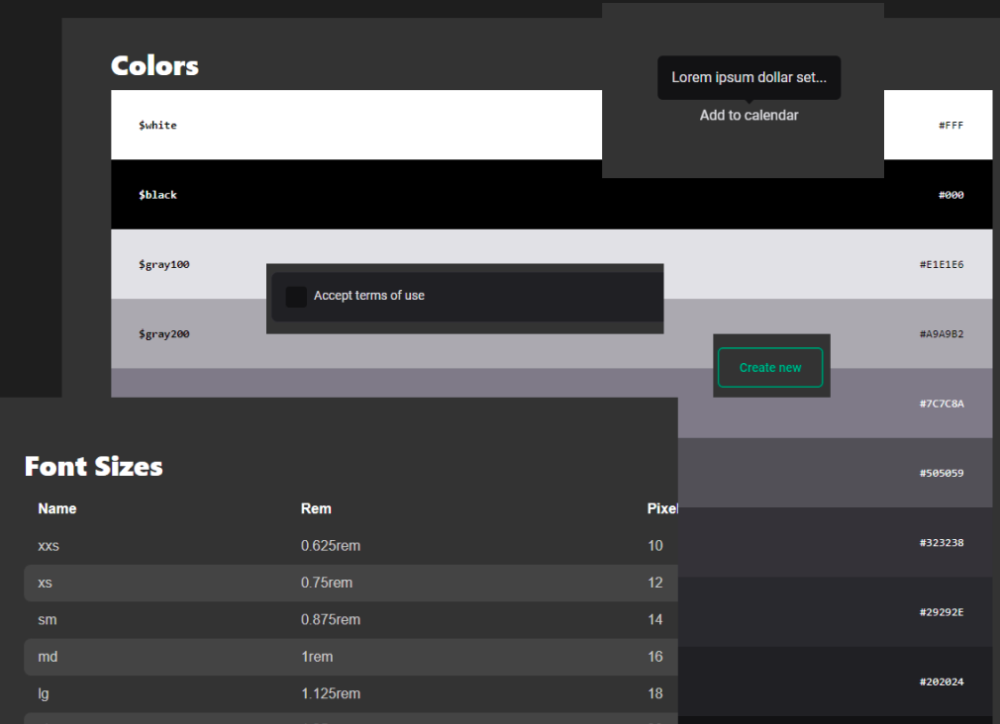

<h1 align="center">Ignite UI - Design System</h1>

<p align="center">
  
  
  <a href="https://github.com/jtiagosantos/design-system/commits/master">
    
  </a>
  
   <a href="https://github.com/jtiagosantos/design-system/stargazers">
    
  </a>
</p>

<h4 align="center"> 
  🚧 Ignite UI - Design System 🎨 Completed 🚀 🚧
</h4>

<p align="center">
  <a href="#-components">Components</a> •
  <a href="#-run-project">Run Project</a> • 
  <a href="#-technologies">Technologies</a> • 
  <a href="#-deploy">Deploy</a> • 
  <a href="#-author">Author</a> • 
  <a href="#-license">License</a>
</p>

<br>

<h1 align="center">
  
</h1>


## 🎨 Components

- [x] Data display
  - [x] Avatar
  - [x] Toast
  - [x] Tooltip
- [x] Surfaces
  - [x] Box
- [x] Form
  - [x] Button
  - [x] Checkbox
  - [x] MultiStep
  - [x] TextInput
  - [x] TextArea
- [x] Typography
  - [x] Heading
  - [x] Text

<br>

## 🚀 Run Project

1️⃣ Clone project and access its folder:

```bash
$ git clone https://github.com/jtiagosantos/design-system.git
$ cd design-system
```

2️⃣ Install dependencies:

```bash
$ npm i
```

3️⃣ Start project:

```bash
$ npm run dev
```

<br>

## 🛠 Technologies

The following tools were used in the construction of project:

- **[Typescript](https://www.typescriptlang.org/)**
- **[React](https://reactjs.org/docs/getting-started.html)**
- **[Monorepo](https://monorepo.tools/)**
- **[Turborepo](https://turbo.build/)**
- **[RadixUI](https://www.radix-ui.com/)**
- **[Storybook](https://storybook.js.org/docs/react/get-started/introduction)**
- **[Storybook Deployer](https://github.com/storybookjs/storybook-deployer)**
- **[Github Actions](https://github.com/features/actions)**

<br>

## ☁️ Deploy

- [Web docs](https://jtiagosantos.github.io/design-system/?path=/story/home--page)

<br>

## 👨‍💻 Author


<strong><a href="https://github.com/jtiagosantos">Tiago Santos </a>🚀</strong>

[](https://www.linkedin.com/in/josetiagosantosdelima/)
[](mailto:tiago.santos@icomp.ufam.edu.br)

<br>

## 📝 License

This project is under license [MIT](./LICENSE).
